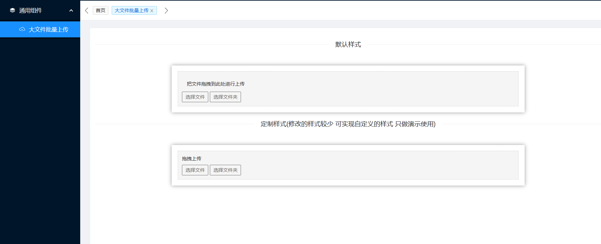
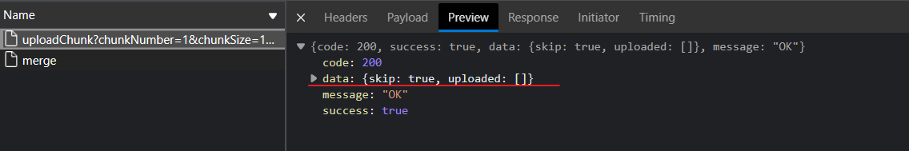
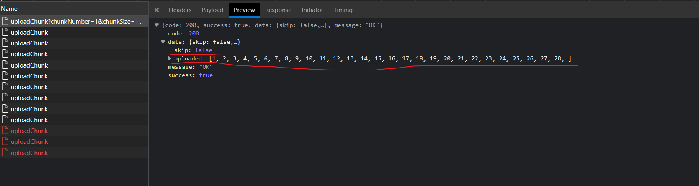

# react-simple-upload

一个基于 [simple-uploader.js](https://github.com/simple-uploader/Uploader) 的 react 的上传组件,是[vue-simple-uploader](https://github.com/simple-uploader/vue-uploader)的 react 实现，并对秒传和断点续传做了一些优化方案。

[在线体验](http://47.98.204.143:3000/components/uploader)(账号：test;密码：test)



## 特性

- 支持文件、多文件、文件夹上传

- 支持拖拽文件、文件夹上传

- 统一对待文件和文件夹，方便操作管理

- 可暂停、继续上传

- 错误处理

- 支持“快传”，通过文件判断服务端是否已存在从而实现“快传”

- 支持断点续传，通过文件判断服务端存在已上传的文件切片，只上传未上传的切片

- 上传队列管理，支持最大并发上传

- 分块上传，并发控制

- 支持进度、预估剩余时间、出错自动重试、重传等操作

## 安装

```bash
npm i react-simple-upload
```

## 使用

样式为默认样式，需要定制样式请看[例子](#example)


```tsx
import Uploader from 'react-simple-upload';
import { UploadFile } from 'react-simple-upload/dist/types';
export default function Upload() {
  const [options] = useState({
    target: '//localhost:3000/upload',
    testChunks: false
  });
  const complete = () => {
    console.log('complete');
  };
  return <Uploader options={options}></Uploader>;
}
```

## 组件

### Uploader

上传根组件，可以直接使用选择其默认样式，也可以使用 UploaderBtn 等组件自定义样式及结构

#### API

<table border = "1">
<tr>
<td align="center"> 参数 </td> <td align="center"> 说明 </td> <td align="center">类型</td> <td align="center">默认值</td>
</tr>
<tr>
<td align="center"> options </td>
<td align="center"> <a href = "https://github.com/simple-uploader/Uploader/blob/develop/README_zh-CN.md">simple-uploader.js uploader实例配置</a> </td>
<td align="center"> UploadeOptions </td>
<td align="center">
 见<a href = "https://github.com/simple-uploader/Uploader/blob/develop/README_zh-CN.md">simple-uploader.js文档</a>
</td>
</tr>
<tr>
<td align="center"> fileStatusText </td>
<td align="center">
用于转换文件上传状态文本映射对象。
</td>
<td align="center">

```ts
object | function(status:"success"|"error"|"uploading"|"paused"|"waiting",response):string
```

</td>
<td>

```json
{
  "success": "success",
  "error": "error",
  "uploading": "uploading",
  "paused": "paused",
  "waiting": "waiting"
}
```

</td>
</tr>
<tr>
<td align="center">
autoStart
</td>
<td align="center">
是否选择文件后立即上传
</td>
<td align="center">
Boolean
</td>
<td align="center">

true</td>

</tr>
<tr>
<td align="center">
onFileAdded
</td>
<td align="center">
这个事件一般用作文件校验，如果说返回了 false，那么这个文件就会被忽略，不会添加到文件上传列表中
</td>
<td align="center">

```ts
(file: UploadFile) => boolean;
```

</td>
<td align="center">

```ts
(file) => true;
```

</td>
</tr>
<tr>
<td align="center">
onFilesAdded
</td>
<td align="center">
fileAdded 一样，但是一般用作多个文件的校验
</td>
<td align="center">

```ts
(files: UploadFile[], fileList: UploadFile[]) => boolean;
```

</td>
<td align="center">

```ts
() => true;
```

</td>
</tr>
<tr>
<td align="center">onFilesSubmitted</td>
<td align="center">和 filesAdded 类似，但是是文件已经加入到上传列表中，一般用来开始整个的上传</td>
<td align="center">

```ts
(files: UploadFile[],fileList: UploadFile[],e: Event) => void;
```

</td>
<td align="center">

```ts
() => {};
```

</td>
</tr>
<tr>
<td align="center">onFileProgress</td>
<td align="center"> 一个文件正在上传</td>
<td align="center">

```ts
(rootfile: UploadFile,file: UploadFile,chunk: UploadChunk) => void;
```

</td>
<td align="center">

```ts
()=>void
```

</td>
</tr>
<tr>
<td align="center">onFileSuccess</td>
<td align="center">文件上传成功事件,rootFile 就是成功上传的文件所属的根 Uploader.File 对象，它应该包含或者等于成功上传文件； file 就是当前成功的 Uploader.File 对象本身；message 就是服务端响应内容，永远都是字符串；chunk 就是 Uploader.Chunk 实例，它就是该文件的最后一个块实例，如果你想得到请求响应码的话，chunk.xhr.status 就是。</td>
<td align="center">

```ts
 (rootFile: UploadFile,file: UploadFile,message: string,chunk: UploadChunk) => void;
```

</td>
<td align="center">

```ts
() => {};
```

</td>
</tr>
<tr>
<td align="center">
onFileComplete
</td>
<td align="center">
一个根文件（文件夹）成功上传完成。
</td>
<td align="center">

```ts
(rootFile: UploadFile) => void
```

</td>
<td align="center">

```ts
() => {};
```

</td>
</tr>

<tr>
<td align="center">onComplete</td>
<td align="center"> 上传完毕</td>
<td align="center">

```ts
() => void
```

</td>
<td align="center">

```ts
() => {};
```

</td>
</tr>
<tr>
<td align="center">
onFileRemove
</td>
<td align="center">
一个文件（文件夹）被移除
</td>
<td align="center">

```ts
(file: UploadFile) => void;
```

</td>
<td align="center">

```ts
() => {};
```

</td>
</tr>
<tr>
<td align="center">
onFileRetry
</td>
<td align="center">
文件重试上传事件
</td>
<td align="center">

```ts
 (rootFile: UploadFile,file: UploadFile,chunk: UploadChunk) => void
```

</td>
<td align="center">

```ts
() => {};
```

</td>
</tr>
<tr>
<td align="center">onFileError</td>
<td align="center">上传过程中出错了</td>
<td align="center">

```ts
(rootFile: UploadFile,file: UploadFile,message: string,chunk: UploadChunk)=>void;
```

</td>
<td align="center">

```ts
() => {};
```

</td>
</tr>

<tr>

<td align="center">children</td>
<td align="center">自定义样式时使用，类似Vue的作用域插槽</td>
<td align="center">

```ts
({ fileList }: { fileList: UploadFile[] }) => JSX.Element;
```

</td>
<td align="center"> - </td>

</tr>
</table>

### UnSupport

当前浏览器是否支持 File API 上传，不支持时作提示使用

#### API

<table border="1">
<tr>
<td align="center"> 参数 </td> <td align="center"> 说明 </td> <td align="center">类型</td> <td align="center">默认值</td>
</tr>
<tr>
<td align="center">children</td>
<td align="center">不支持File API上传时的提示信息</td>
<td align="center">

```ts
JSX.Element;
```

</td>
<td align="center">

```tsx
<p>你的浏览器等级过低暂不支持上传组件</p>
```

</td>
</tr>
</table>

### UploaderDrop

拖拽上传组件

#### API

<table border = "1" >
<tr>
<td align="center"> 参数 </td> <td align="center"> 说明 </td> <td align="center">类型</td> <td align="center">默认值</td>
</tr>
<tr>
<td align="center">children</td>
<td align="center">拖拽上传组件区域内显示的内容，一般直接存放上传按钮</td>
<td align="center">

```ts
JSX.Element;
```

</td>
<td>

```tsx
<p className="m-3">把文件拖拽到此处进行上传</p>
<div className="flex">
  <UploaderBtn>选择文件</UploaderBtn>
  <UploaderBtn directory={true}>选择文件夹</UploaderBtn>
</div>
```

</td>
</tr>
</table>

### UploaderBtn

点击上传文件按钮

#### API

<table border="1">
<tr>
<td align="center"> 参数 </td> <td align="center"> 说明 </td> <td align="center">类型</td> <td align="center">默认值</td>
</tr>
<tr>
<td align="center">children</td>
<td align="center">上传按钮中的内容</td>
<td align="center">

```ts
JSX.Element | string;
```

</td>
<td>
-
</td>
</tr>

<tr>
<td align="center">directory</td>
<td align="center">是否上传文件夹</td>
<td align="center">Boolean</td>
<td align="center">false</td>
</tr>

<tr>
<td align="center">single</td>
<td align="center">是否一次只能选择一个文件夹</td>
<td align="center">Boolean</td>
<td align="center">false</td>
</tr>

</table>

### UploaderList

文件文件夹列表

#### API

<table border="1">
<tr>
<td align="center"> 参数 </td> <td align="center"> 说明 </td> <td align="center">类型</td> <td align="center">默认值</td>
</tr>
<tr>
<td align="center">children</td>
<td >类Vue作用域插槽 应该返回UploadFile组件或自定义文件组件使用</td>
<td align="center">

```ts
({ fileList }: { fileList: UploadFile[] }) => JSX.Element;
```

</td>
<td>
 
 ```tsx
 <ul>
   {fileList.map((file) => (
     <UploaderFile key={file.id} file={file} list={true}>
     </UploaderFile>
    ))}
 </ul>
 ```
</td>
</tr>

<tr>
<td align="center">fileList</td>
<td align="center">文件列表</td>
<td align="center">UploadFile[]</td>
<td align="center">-</td>
</tr>

</table>

### UploadFile

文件 文件夹单个组件

### API

<table border="1">
<tr>
<td align="center"> 参数 </td> <td align="center"> 说明 </td> <td align="center">类型</td> <td align="center">默认值</td>
</tr>
<tr>
<tr>
<td align="center">file</td>
<td align="center">文件对象</td>
<td align="center">UploadFile</td>
<td align="center">-</td>
</tr>
<tr>
<td align="center">children</td>
<td>
文件组件的类Vue作用域插槽 返回新的自定义的上传组件
<ul>
<li>name: 文件名</li>
<li>size: 文件大小</li>
<li>averageSpeed: 平均上传速度</li>
<li>error: 是否发生错误</li>
<li>paused:是否暂停</li>
<li>isComplete:是否上传完毕</li>
<li>isUploading:是否正在上传</li>
<li>progress:上传进度（0-1）</li>
<li>formatedTimeRemaining:剩余时间</li>
<li>status:文件当前状态</li>
<li>statusText：文件状态转化的业务上传对应状态</li>
<li>fileAdded:文件类型</li>
<li>pause:上传暂停方法</li>
<li>retry:上传重试方法</li>
<li>resume:上传继续方法</li>
<li>remove:上传移除方法</li>
</ul>
</td>
<td>

```ts
(fileInfo: {
  name: string;
  size: string;
  averageSpeed: string;
  error: boolean;
  paused: boolean;
  isComplete: boolean;
  isUploading: boolean;
  progress: number;
  formatedTimeRemaining: string;
  status: 'success' | 'error' | 'uploading' | 'paused' | 'waiting';
  statusText: string;
  fileCategory: string;
  pause: () => void;
  retry: () => void;
  resume: () => void;
  remove: () => void;
}) => JSX.Element;
```

</td>
<td align="center">-</td>
</tr>
</table>

## <a id="example"></a>例子

例子主要包含自定义样式 以及 断点续传和秒传的实现

1. 定制样式仅做参考 案例演示的 css 类使用的是 tailwindcss 可以自行调整样式

2. 断点续传和秒传 需要配合服务端共同实现，可以参考[react-admin-background](https://github.com/sunburst89757/react-admin-backend/blob/main/src/router/upload.router.ts)的实现

   - 首先配置 testChunks,checkChunkUploadedByResponse 函数如下
   - testChunks 为 true 时每次上传文件前先发送一个 url 为"/uploadChunk"的 get 请求，判断文件及切片的上传情况，返回值主要是 skip 字段和 uploaded 字段
     - skip:boolean 字段判断是否需要秒传，skip:true，表明文件上传过，直接秒传即可
     - uploaded:number[] 字段表明已经上传过的切片
   - checkChunkUploadedByResponse:这个函数在每个切片正式上传前触发，chunk 参数是当前的切片,message 是 get 请求返回的字符串形式的结果，如果返回 true 表明该切片成功上传，不需要重复上传

   

   

3. 关于 merge 这个请求：这个请求可以根据后端业务需求考虑是否需要单独添加，实际后端服务器是可以在切片上传完成后自动进行合并操作。

```tsx
import { Divider, Space } from 'antd';
import {
  CaretRightOutlined,
  ReloadOutlined,
  PauseOutlined,
  CloseOutlined
} from '@ant-design/icons';
import { useState } from 'react';
import Uploader, {
  UnSupport,
  UploaderBtn,
  UploaderDrop,
  UploaderFile,
  UploaderList
} from 'react-simple-upload';
import { UploadFile, UploadChunk } from 'react-simple-upload/dist/types';
export default function Upload() {
  const [options] = useState({
    target: '//localhost:3000/uploadChunk',
    // 秒传测试，为true进行一次get请求判断上传的内容
    testChunks: true,
    // 每个chunk进行上传前的校验工作，返回true表明该chunk进行上传
    checkChunkUploadedByResponse: (chunk: UploadChunk, message: string) => {
      const { data } = JSON.parse(message);
      if (data.skip) {
        return true;
      }
      return (data.uploaded || []).indexOf(chunk.offset + 1) >= 0;
    }
  });
  // 所有切片上传完成时进行文件合并操作
  const fileComplete = (rootFile: UploadFile) => {
    // 文件夹上传时的合并方式
    if (rootFile.isFolder) {
      for (const file of rootFile.files) {
        merge({
          identifier: file.uniqueIdentifier,
          filename: file.name,
          uploadBy: userId,
          size: file.size
        });
      }
    } else {
      // 文件上传时的合并方式
      merge({
        identifier: uploadTool.cleanIdentifier(rootFile.uniqueIdentifier),
        filename: rootFile.name,
        uploadBy: userId,
        size: uploadTool.transferSize(rootFile.size)
      });
    }

    console.log(rootFile, 'fileComplete');
  };
  const complete = () => {
    console.log('complete');
  };
  return (
    <Uploader
      options={options}
      onFileComplete={fileComplete}
      onComplete={complete}
    >
      {({ fileList }) => (
        <>
          <UnSupport></UnSupport>
          <UploaderDrop>
            <>
              <p>拖拽上传</p>
              <div className="flex mt-2">
                <UploaderBtn>选择文件</UploaderBtn>
                <UploaderBtn directory={true}>选择文件夹</UploaderBtn>
              </div>
            </>
          </UploaderDrop>
          <UploaderList fileList={fileList}>
            {() => (
              <>
                {fileList.map((file) => (
                  <UploaderFile file={file} list={true} key={file.id}>
                    {({
                      name,
                      size,
                      averageSpeed,
                      pause,
                      retry,
                      remove,
                      resume,
                      formatedTimeRemaining,
                      error,
                      isComplete,
                      isUploading,
                      paused,
                      status,
                      statusText,
                      progress,
                      fileCategory
                    }) => (
                      <div className="uploader-file flex ">
                        <span className="flex-1">{fileCategory}</span>
                        <span className="flex-1">{name}</span>
                        <span className="flex-1">{size}</span>
                        <span className="flex-1">
                          {isUploading ? (
                            <>
                              <span>{Math.floor(progress * 100) + '%'}</span>
                              <span className="mx-3">{averageSpeed}</span>
                              <span>{formatedTimeRemaining}</span>
                            </>
                          ) : (
                            statusText
                          )}
                        </span>
                        {isUploading && (
                          <div className="flex-1 flex items-center justify-center ">
                            <Space>
                              <PauseOutlined onClick={pause} />
                              <CloseOutlined onClick={remove} />
                            </Space>
                          </div>
                        )}
                        {error && (
                          <span
                            className="flex-1 flex items-center justify-center "
                            onClick={retry}
                          >
                            <ReloadOutlined />
                          </span>
                        )}
                        {paused && (
                          <span
                            className="flex-1 flex items-center justify-center "
                            onClick={resume}
                          >
                            <CaretRightOutlined />
                          </span>
                        )}
                      </div>
                    )}
                  </UploaderFile>
                ))}
              </>
            )}
          </UploaderList>
        </>
      )}
    </Uploader>
  );
}
```
